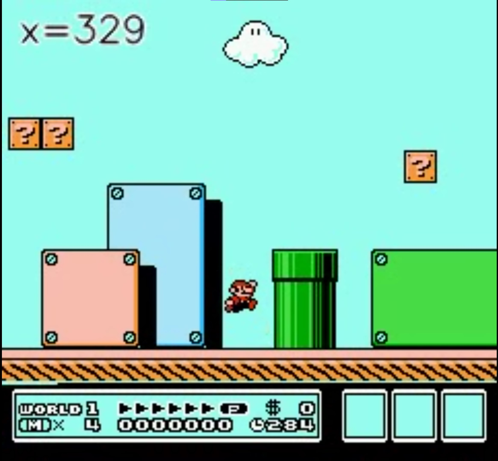

# Mario Reinforcement Learning (SMB3) – Setup

Dieses Projekt trainiert einen PPO-Agenten (Stable-Baselines3) auf **SuperMarioBros3-Nes** mit **gym-retro**.
Das Projekt benutzt einen **Custom-Integration-Ordner** unter `retro_custom/`, in dem ROM, States und Szenario/Reward-Definitionen liegen.
**Wichtig:** Die Rom muss selber intergriert werden!

---

## Setup: WSL2 Ubuntu 22.04 (Windows)

### 1) WSL Ubuntu 22.04 installieren

In Windows PowerShell (als Admin):

```bash
wsl --install -d Ubuntu-22.04
```

Danach Ubuntu starten (Startmenü: „Ubuntu 22.04“), Benutzer anlegen und ein Update machen:

```bash
sudo apt update && sudo apt upgrade -y
```

### 2) Systempakete (Ubuntu) installieren

```bash
sudo apt update
sudo apt-get install -y \
  git build-essential cmake ffmpeg pkg-config \
  zlib1g-dev libgl1 libglib2.0-0 \
  python3-pip
```

Optional (nur für das Qt-GUI Tool `gym-retro-integration`):

```bash
sudo apt-get install -y capnproto libcapnp-dev libqt5opengl5-dev qtbase5-dev
```

### 3) Python 3.8 installieren (Ubuntu 22.04)

Ubuntu 22.04 bringt standardmäßig Python 3.10 mit. Für dieses Repo wird **Python 3.8** genutzt.

Wenn `python3.8` bei dir schon verfügbar ist, brauchst du oft nur das venv-Modul:

```bash
sudo apt update
sudo apt-get install -y python3.8-venv python3.8-dev
```

Falls Ubuntu die Pakete nicht findet (typisch auf 22.04 ohne Zusatz-Repos), nutze das deadsnakes PPA:

```bash
sudo apt-get install -y software-properties-common
sudo add-apt-repository ppa:deadsnakes/ppa
sudo apt update
sudo apt-get install -y python3.8 python3.8-venv python3.8-dev
```

Wenn du Python 3.8 bereits anders installiert hast (z.B. `pyenv`), ist das auch ok – Hauptsache `python3.8` ist verfügbar.

---

## Projekt installieren (virtuelle Umgebung)

### 1) Repo klonen

```bash
cd ~
git clone git@github.com:Bugi-Shi/bachelor-mario3.git bachelor
cd bachelor
```

### 2) Virtuelle Umgebung (Python 3.8) erstellen & Dependencies installieren

Das Repo enthält ein Setup-Skript, das eine venv unter `project/` erstellt und alle Pakete per `pip` installiert:

Wichtigste Python-Pakete, die dabei installiert werden (Auszug):

- `gym-retro` (liefert `retro`)
- `gymnasium`
- `stable_baselines3` (PPO)
- `torch`
- `numpy`, `pandas`
- `tensorboard`
- `opencv-python`, `matplotlib`

Die vollständige, gepinnte Liste steht in `requirements-lock.txt`.

```bash
chmod +x setup.sh
./setup.sh
```

Aktivieren:

```bash
source project/bin/activate
```

Hinweise:
- `setup.sh` nutzt standardmäßig `python3.8` und installiert standardmäßig aus `requirements-lock.txt`.
- Falls dein Python-Binary anders heißt, kannst du es setzen: `PYTHON_BIN=/pfad/zu/python3.8 ./setup.sh`

---

## gym-retro + Custom-Ordner (`retro_custom/`)

### Was wird benutzt?

- **gym-retro** liefert das Python-Modul `retro`.
- Das Environment wird so gebaut, dass **nur** deine Custom-Integration verwendet wird (`CUSTOM_ONLY`).
- Der Pfad zur Custom-Integration ist im Training standardmäßig:
  - `retro_custom/` (siehe `custom_data_root` in `sandbox.py`).

### Erwartete Ordnerstruktur

Die Custom-Daten liegen unter:

`retro_custom/SuperMarioBros3-Nes/`

Typischer Inhalt (Beispiele aus diesem Repo):

- `rom.nes` und `rom.sha`
- `metadata.json` (enthält u.a. `default_state`)
- `scenario.json` / `data.json`
- `*.state` (z.B. `1Player.World1.Level1.state`, `1Player.World1.Level2_Pit.state`, ...)

### ROM prüfen

Im Ordner `retro_custom/SuperMarioBros3-Nes/`:

```bash
cat rom.sha
sha1sum rom.nes
```

Die Checksums sollten übereinstimmen.

---

## Training starten

```bash
# (empfohlen) venv-python direkt nutzen
./project/bin/python -u main.py

# Profile:
./project/bin/python -u main.py --laptop
./project/bin/python -u main.py --pc
```



Beim Start wird automatisch ein neuer Run-Ordner unter `outputs/runs/<YYYY-MM-DD_HH-MM-SS>/` angelegt. Dort landen u.a.:

- `tb/` – TensorBoard Event-Files (für Metriken/Scalars)
- `stats/episode_stats.csv` – Episoden-Statistiken (z.B. Reward, Len, x/hpos)
- `deaths/` – Death-Logs als `.jsonl`
- `deaths_overlay.png` – Overlay für diesen Run

Zusätzlich wird run-übergreifend geschrieben:

- `outputs/allDeath.jsonl` – globale Death-Historie (JSONL)
- `outputs/all_deaths_overlay.png` – Overlay aus allen Runs

Abbruch:
- Mit `Ctrl+C` kannst du Training abbrechen (Worker sollten dabei möglichst leise bleiben).

Death-Overlays nachträglich generieren:
```bash
./project/bin/python -u main.py --death
./project/bin/python -u main.py --death latest
./project/bin/python -u main.py --death outputs/runs/<RUN_ID>
```

Hinweis (Gym-Banner):
- Das "Gym has been unmaintained..." Banner wird im venv per Startup-Hook unterdrückt. Nutze dafür am besten `./project/bin/python ...`.

---

## gym-retro Integration Tool (GUI) bauen/ausführen

Wichtig: Das per `pip install gym-retro` installierte Paket enthält normalerweise **nicht** das GUI-Tool `gym-retro-integration`. Dafür brauchst du den gym-retro Source-Checkout + Build.

Im Repo sind dafür Scripts hinterlegt:

```bash
# 1) System-Dependencies (falls noch nicht installiert)
sudo apt update
sudo apt-get install -y cmake git build-essential \
	capnproto libcapnp-dev libqt5opengl5-dev qtbase5-dev zlib1g-dev \
	pkg-config libbz2-dev

# 2) Tool bauen (klont automatisch nach external/gym-retro)
bash tools/retro_integration/build.sh

# 3) Tool starten
bash tools/retro_integration/run.sh
```

Hinweis zu WSL2: Das Tool ist eine Qt-GUI. Du brauchst WSLg (Windows 11) oder einen X-Server, sonst startet das Fenster nicht.

#### "Was sieht der Agent wirklich?" (Grayscale/Resize/Frame-Stack prüfen)

Das normale Retro-Render-Fenster zeigt die **rohen** Frames aus dem Emulator.
Um die Observation zu sehen, die tatsächlich ins Modell geht (grayscale + resize
auf 84x84 + frame-stack), kannst du dir PNGs dumpen lassen:

```bash
./project/bin/python -m utils.agent_view --out outputs/agent_view
```

Das schreibt zwei Dateien:

- `outputs/agent_view/agent_view_last.png` – letztes Frame aus dem Stack
- `outputs/agent_view/agent_view_stack.png` – alle gestackten Frames als Montage

#### TensorBoard / „Tensorflow Dateien“ (Event-Files) auslesen

TensorBoard liest die Event-Files aus dem `tb/`-Ordner. Du kannst entweder einen einzelnen Run anzeigen oder alle Runs zusammen.

**1) Einen einzelnen Run anzeigen**

```bash
# Beispiel: einen konkreten Run öffnen
./project/bin/tensorboard --logdir outputs/runs/ --port 6006
```

**2) Alle Runs zusammen anzeigen**

```bash
./project/bin/tensorboard --logdir outputs/runs --port 6006
```

Danach im Browser öffnen:

- `http://localhost:6006`

Wenn du in WSL/Remote arbeitest und von außen zugreifen willst, nutze zusätzlich:

```bash
./project/bin/tensorboard --logdir outputs/runs --port 6006 --bind_all
```
